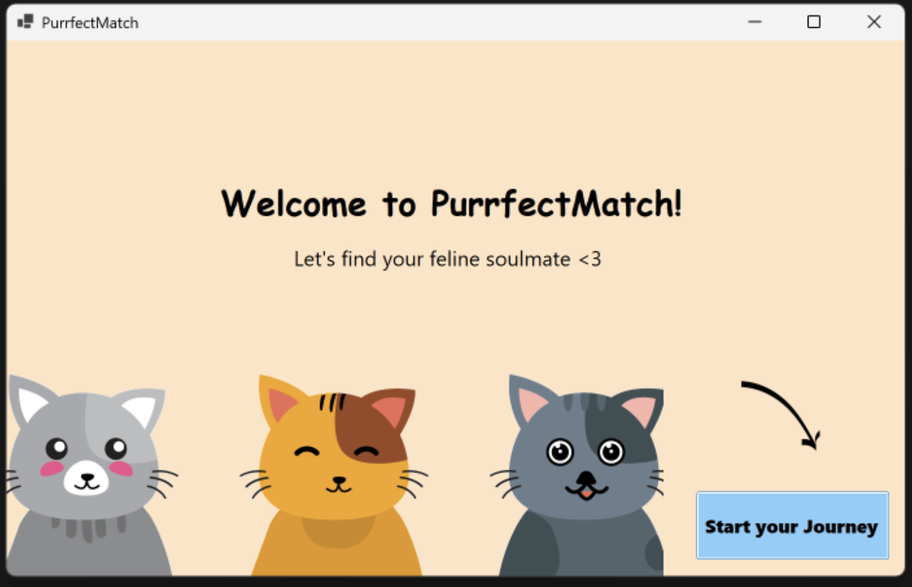
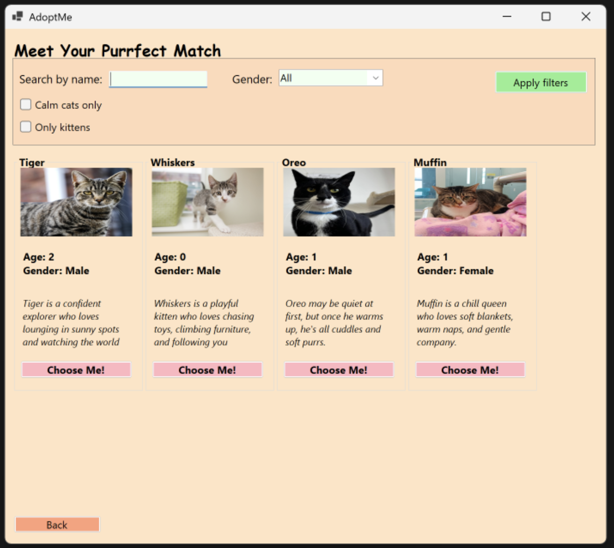
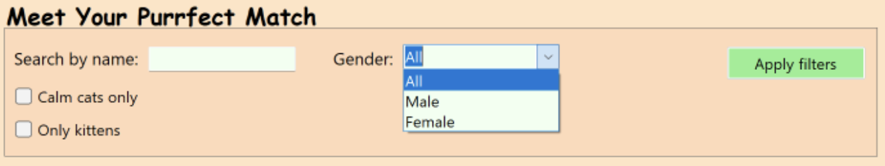
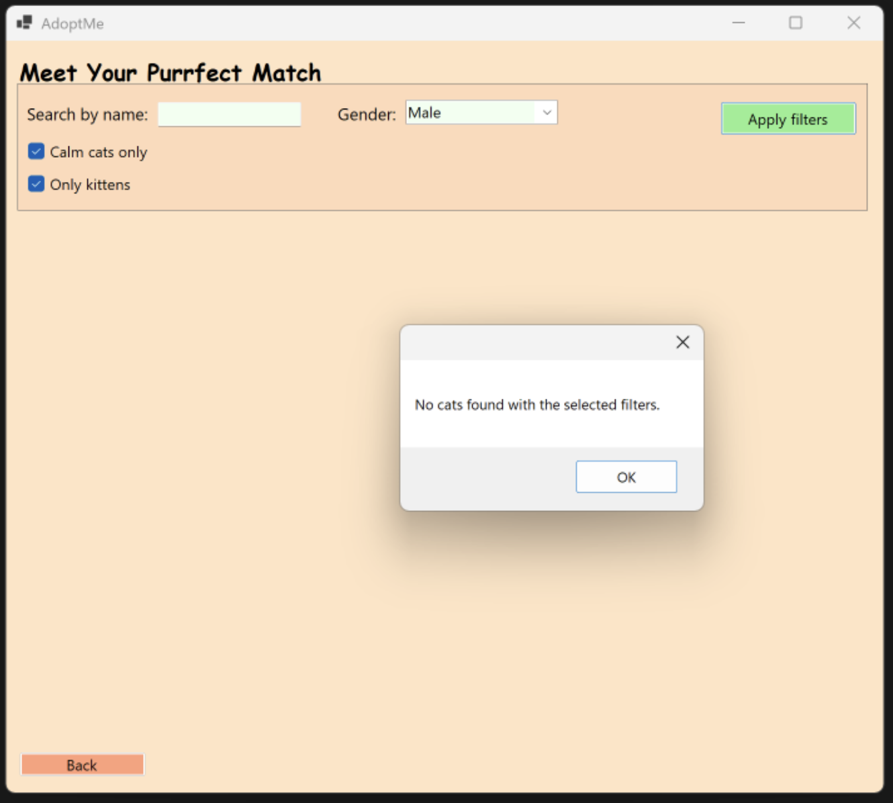
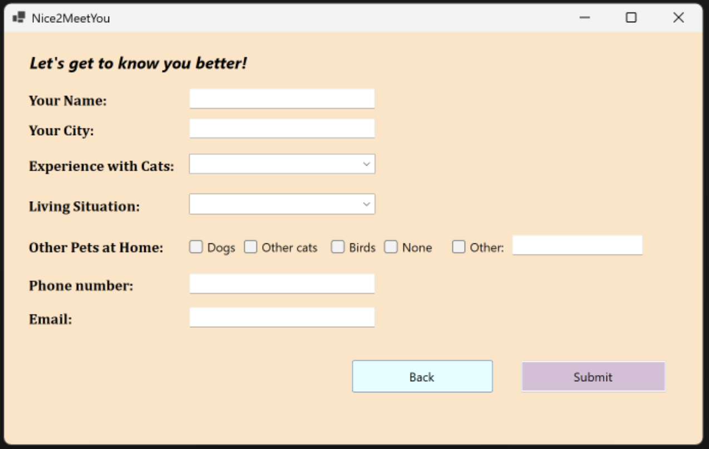
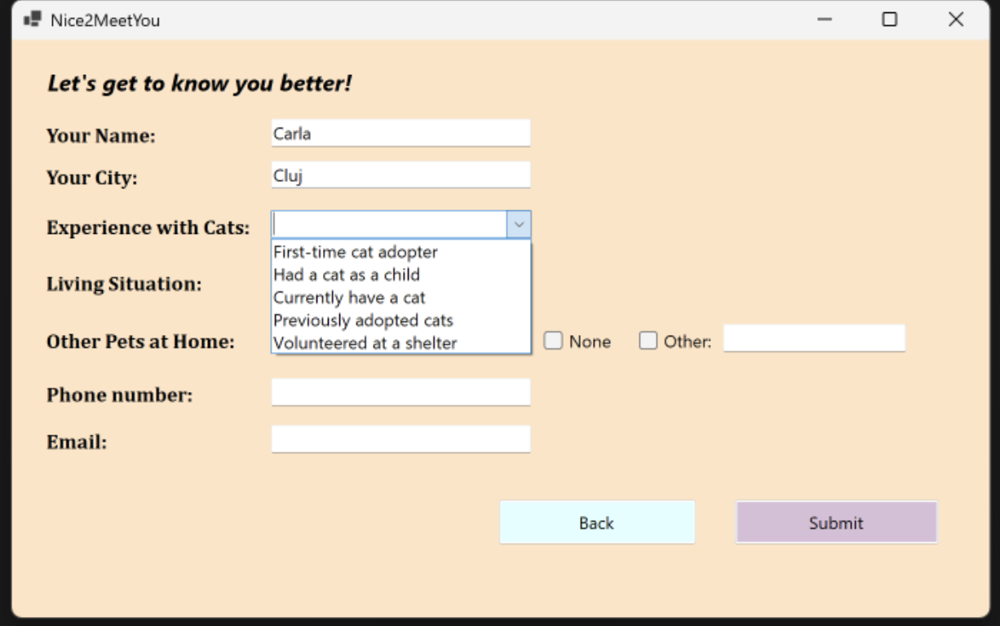
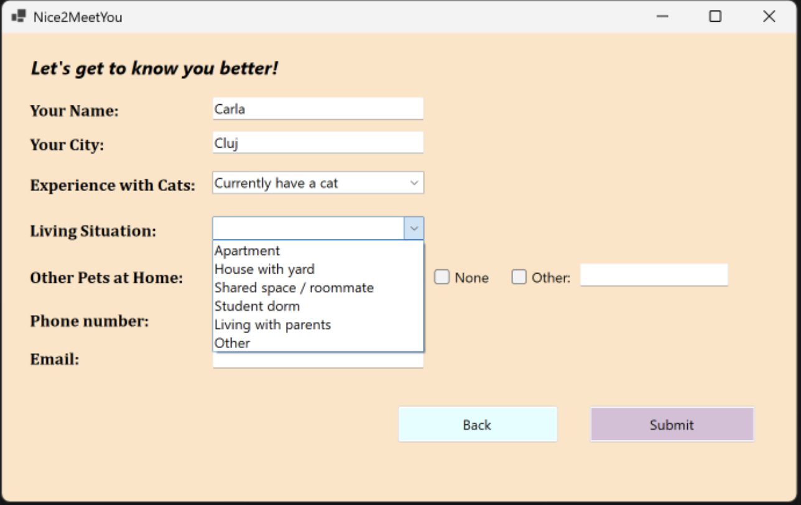
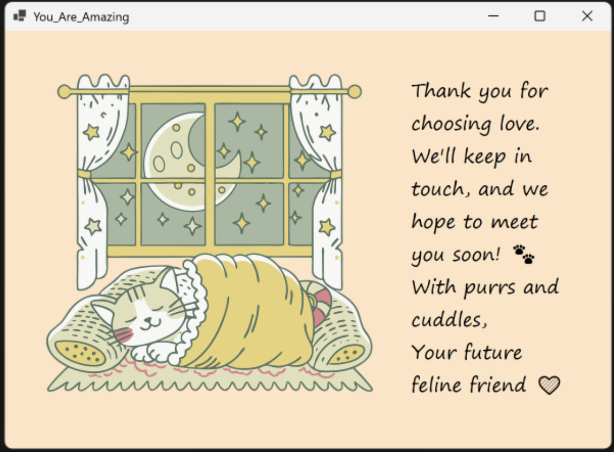

# PurrfectMatch 

**PurrfectMatch** is a Windows Forms application that helps users find and "adopt" the perfect cat based on their preferences. It offers a friendly, animated UI with a smooth step-by-step selection process — turning a fun idea into an interactive digital adoption experience.

---

##  Features

- Filter cats by name, gender, and behavior 
- Dynamic cat cards with image, name, age, personality, and a **"Choose Me!"** button
- Step-by-step adoption form:
  - User info (name, city, experience with cats, living situation, other pets, contact)
  - Input validation with custom error messages
- Custom popup message when no cats match selected filters
- Final thank-you screen with animated artwork

---

## Technologies Used

- **C#**
- **.NET Windows Forms**
- Event-driven programming
- UI controls (FlowLayoutPanel, ComboBox, CheckBox, GroupBox)

---
## How to Run

1. Open the solution in **Visual Studio**.
2. Build the project.
3. Run the application locally.
4. Click **“Start your journey”** and follow the steps to adopt your cat!

---

## UI Preview

The app starts with a welcoming screen where users are invited to begin their journey toward finding the perfect cat companion. 

Once inside, users are presented with multiple cat profiles. Each profile shows an image, name, age, personality, and a button that invites interaction — **"Choose Me!"**.

To refine their choices, users can filter cats by name, gender, and specific traits like “kitten” or “calm”.
 

If no cats match the selected filters, a custom popup appears, encouraging users to try again with different options.
 

After choosing a cat, the user is guided through a multi-step form to complete the adoption process. The form collects key information like name, city, contact details, and living environment.
 

Additional form sections allow users to select their experience with cats...

...and provide information about their living situation and whether other pets are present.

Once everything is completed, a personalized thank-you screen is shown — ending the process with a warm and friendly message.

---

## Notes

This project was built without database integration (due to device constraints). It can be extended with:
- Local or cloud database for persistent data
- Email notifications
- User login & authentication system

---
## Contact

For more details or collaboration:
- Email: carlabarastean@gmail.com
- LinkedIn: [linkedin.com/in/carla-barastean-621326269](https://www.linkedin.com/in/carla-barastean-621326269)

Thank you for visiting this project!

---

*Because everyone deserves their purrfect match.*
